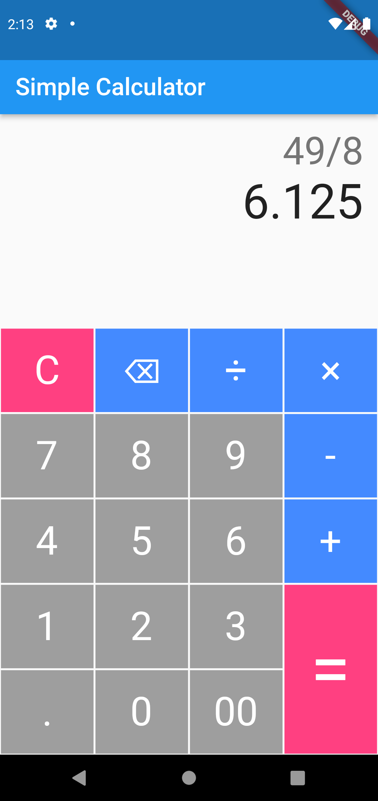

<h1 align="center">
   🧮 <a href="#"> Simple Calculator </a>
</h1>

<h3 align="center">
    A calculator app.
</h3>

<p align="center">
  
  
  <a href="https://github.com/hericles-koelher/simple_calculator/blob/master/README.md">
    
  </a>
    
   

  <a href="https://rocketseat.com.br">
    
  </a>

</p>


<h4 align="center"> 
	 Status: Finished
</h4>

<p align="center">
 <a href="#about">About</a> •
 <a href="#how-it-works">How it works</a> • 
 <a href="#tech-stack">Tech Stack</a> • 
 <a href="#author">Author</a> • 
 <a href="#user-content-license">License</a>

</p>


## About

🧮 Simple Calculator - is just an little project made with the purpose of study mobile development with:

- **[Flutter](https://flutter.dev/)**
- **[State Management](https://en.wikipedia.org/wiki/State_management)**
- **[Change Notifier](https://api.flutter.dev/flutter/foundation/ChangeNotifier-class.html)**
- **[Provider](https://pub.dev/packages/provider)**

---

### Mobile

<p align="center">
  
</p>

---

## How it works

This app works much like any built-in calculator app.

### Pre-requisites

Before you begin, you will need to have [Flutter](https://flutter.dev) and [Android Studio](https://developer.android.com/studio?hl=pt) installed in your machine. In addition use your smartphone or an emulator to run the app.

#### Running the application

Open the project with your IDE and run it by clicking play or via command line with:

```bash
# command line in the root of your project
$ flutter run
```
---

## Tech Stack

The following tools were used in the construction of the project:


#### **Mobile**  ([Flutter](https://flutter.dev))

-   **[Provider](https://pub.dev/packages/provider)**
-   **[Math Expressions](https://pub.dev/packages/math_expressions)**
-   **[Auto Size Text](https://pub.dev/packages/auto_size_text)**

> See the file  [pubspec.yaml](https://github.com/hericles-koelher/simple_calculator/blob/master/README.md)

#### **Utilities**

-   Editor:  **[Android Studio](https://developer.android.com/studio?hl=pt)**  → Plugin:  **[Flutter](https://plugins.jetbrains.com/plugin/9212-flutter)**, **[Dart](https://plugins.jetbrains.com/plugin/6351-dart)**

---

## Author

<div>
 
 <br />
 <sub><b>Hericles Koelher</b></sub>
</div>

[](https://twitter.com/HericlesKoelher) [](https://www.linkedin.com/in/hericles-bruno-quaresma-koelher-9a2021209) 

---

## License

This project is under the license [MIT](./LICENSE).

Made with love by Hericles Koelher 👋🏽 [Get in Touch!](https://www.linkedin.com/in/hericles-bruno-quaresma-koelher-9a2021209)
